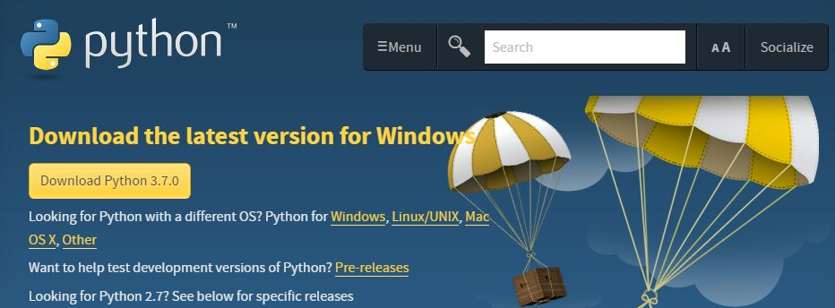
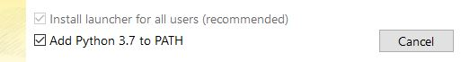
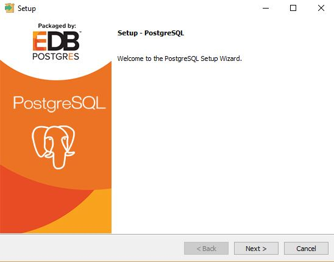
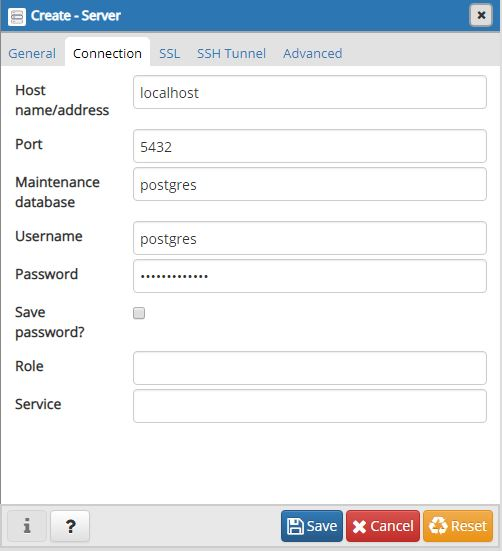
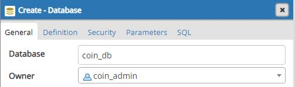
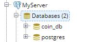

# Introduction

GenCyberCoin is the project developed by Dr. Vitaly Ford in collaboration with Cybersecurity Education Research and Outreach Center at Tennessee Tech University (Dr. Ambareen Siraj) as a part of the NSA/NSF GenCyber grant. GenCyberCoin is a web platform that teaches students the following concepts:

- Cryptocurrency concepts and digital currency trading markets, including blockchain applications
- Cybersecurity principles (confidentiality, integrity, availability, defense in depth, keep it simple, think like an adversary)
- Bug bounty program, software bugs, and secure coding
- Password management and its strength
- Social and ethical norms and values
- Reconnaissance

GenCyberCoin has been successfully deployed at Tennessee Tech's GenCyber summer camps in 2017 and 2018. Students of 8-12 grades expressed high enthusiasm and actively participated in the GenCyberCoin platform, searching for bugs, performing reconnaissance, and earning coins for their leadership skills and willingness to learn cybersecurity. They later spent their coins at the GenCyberCoin marketplace to buy real items that our camp's Team has prepared for them.

GenCyberCoin reinforces the objectives that the GenCyber program has established. It complements the existing GenCyber camp activities and facilitates building curiosity and passion to pursue cybersecurity and to solve challenges in this field.

# Local setup instructions

## Software installation and configuration

1. Install [python3](https://www.python.org/downloads/), and [PostgreSQL server](https://www.postgresql.org/download/). Installation directions below.

#### Python
  * Click the yellow button to download the latest version. Refer to the links under the button for downloading Python on other operating systems such as Mac OS or Linux/UNIX. 
  
  * **IMPORTANT** Be sure to check the box next to "Add Python 'latest version' to PATH"
  

#### PostgreSQL
  * Select which operating system you are using to download PostgreSQL. 
  
  * Click "Download the installer", and be sure to select the latest version (_currently 10.5_). This version comes with pgAdmin 4.  
  
  * Open the installer to access the PostgreSQL Setup Wizard.
  
  You can leave all components checked, and do not have to change the locale or port number. The default port number should be 5432.
  **Be sure to remember your database superuser password.**

2. After downloading or cloning this repository, navigate to the cryptocoin directory in the command line prompt or terminal (there should be requirements.txt file in that directory).
3. Install the latest version of pip by typing the following command: 
`python -m pip install --upgrade pip` 
4. Install the prerequisites by typing the following command: 
`pip install -r requirements.txt`
#### Possible Errors
  * If you encounter the error "pg_config executable not found" when trying to install the psycopg2 package, try running the following command to install it individually:
  `pip install psycopg2`  
  * If you encounter an error while installing the reportlab package, try installing the latest [Microsoft Visual C++ build tools](https://visualstudio.microsoft.com/downloads/).  Scroll down to "All downloads" and expand "Tools for Visual Studio 2017", and download "Build Tools for Viual Studio 2017".
  
  Check the box for Visual C++ build tools, then click "Install" in the bottom right.
  
  Note, this installation may take a few minutes.

5. Start PostgreSQL server by connecting to it using pgAdmin.
   * Launch pgAdmin
   * Create a server 
     -right click on "Servers", hover over "Create", and select "Server...".
     
     -Under the `General` tab, be sure to give it a name (you can call it MyServer)
     -Under the `Connection` tab, type "localhost" for the Host name/address. 
      Make sure that the port number is the same as the one specified during installation.
      Enter your password that you created while installing PostgreSQL.
     
     Click `Save`.
   * Click the plus icon next to your server name
     Right-click on `Login/Group Roles` to create a new role. 
     Under the `General` tab, set the name to `coin_admin`; 
     Under the `Definition` tab, set `Password` to `go-figure-me-cow`;
     Under the `Privileges` tab, set `Can login?` to `Yes`.
     Click `Save`.
   * Right-click on `Databases` to create a database. 
     Name it `coin_db` and set the `Owner` to `coin_admin`.
     
     Click `Save`.
     Make sure that you are connected to the coin_db. It is disconnected if it displays a red 'x'. Click on it to connect to it.
     
6. In the command line prompt or terminal that is opened in the cryptocoin directory, type the following command: 
`python manage.py migrate` 
which will migrate the existing database model to the PostgreSQL server.
7. At this point your Database setup on the local machine is finished and you can launch the GenCyberCoin project.

## Launching GenCyberCoin project

1. Make sure you started PostgreSQL server.
2. Navigate to the GenCyberCoin project's directory called cryptocoin in the command line prompt or terminal.
   * Type the following command: 
   `python manage.py runserver 80` 
   which will launch GenCyberCoin project on the local machine, port 80.
   * Open your browser and type the following in the address bar: 
   `localhost`
   * At this point you should be able to see the GenCyberCoin's front page.

# Amazon Web Services (AWS) setup instructions

## AWS account setup

1. Create an AWS account [here](https://aws.amazon.com/free/ "Create AWS Account with Free Tier") (for a new user, first year falls under a Free Tier that provides enough free AWS resources to deploy and run GenCyberCoin project for the whole year).
2. You can also [apply to join](https://www.awseducate.com/registration#APP_TYPE "AWS Educate Program") the AWS Educate Program as an Institution and within a few weeks, if approved, you will be able to receive a certain number of free AWS credits as an AWS Educator which will be enough to run GenCyberCoin for half a year (the rest of the year the machines will be shut down in any case) in the following years.

## Software installation and configuration

1. Install python3 and pip.
2. Follow the instructions on [Install the Elastic Beanstalk Command Line Interface](https://docs.aws.amazon.com/elasticbeanstalk/latest/dg/eb-cli3-install.html) to install EB CLI.

## Launching GenCyberCoin project

1. Initial setup: type the following commands in the command line prompt or terminal, navigating to the cryptocoin project's directory where you will see `manage.py` and `requirements.txt` files.
   * `eb init`
   * `eb create -db.engine postgres` (python 3.6 or later, say `yes` to ssh, and also create your keys)
   * `eb console` (it will open the browser with the initialized project)
   * `eb config` (**IMPORTANT**: it will open the file in which you should find WSGI path and change it to `cryptocoin/cryptocoin.wsgi.py`)

2. Database setup
   * Type `eb console` in the command line prompt or terminal (it will open the browser with the initialized project)
   * Click the `Configuration` link.
   * Scroll all the way to the bottom of the page, and then under the `Database` section, click the link `Modify`.
   * On the RDS setup page change the `Engine` to `postgres`.
   * Add a `Master Username` and `Master Password`.
   * Save the changes.

3. Type `eb deploy` and in a few minutes your GenCyberCoin project should be running on AWS Elastic Beanstalk that you can find either by typing `eb console` or navigating to [AWS Console](https://console.aws.amazon.com/console/home "AWS Console") in your browser and selecting `Elastic Beanstalk` among the `AWS Services`.

# Creating administrators

The default superuser that is allowed to create school administrators can log in with the following credentials:  
username: `gcsuperuser` 
password: `gcsuperuser`  
**EXTREMELY IMPORTANT**: As soon as you log in, change your password immediately on the `Account` page. 

After generating codes for your GenCyber Team (administrators of your GenCyber summer camp) on the `Code generator` page under `Admin` menu, your GenCyber Team can register their accounts on the front page of GenCyberCoin, using those codes. 

**IMPORTANT**: when you register the accounts, make sure that your security answers are not easy to guess based on the questions because there is a `Forgot your password` option that allows you to enter the account by guessing correctly two security questions out of three which means that your K12 students could potentially try to social engineer one of your GenCyber Team members to get into their accounts, just saying. 

Additional `admin panel` exists for the `gcsuperuser` that you can access by navigating to `localhost/gcsuperuser/` (both slashes are important to type). However, use this `admin panel` at your own risk because it access directly the data that relates to everything on the website.

# Questions/bugs/suggestions?

Contact Vitaly Ford fordv@arcadia.edu with one of the following subject lines, depending on what you would like to inquire:  
`GenCyberCoin:Bug` 
`GenCyberCoin:Question` 
`GenCyberCoin:Suggestion`

# Acknowledgements

We thank [NSA/NSF GenCyber program](https://www.gen-cyber.com/ "NSA/NSF GenCyber Program") for funding the implementation of this project.

We also thank Andrew Malinsky (CS student at Arcadia University) for bug hunting, testing the project's code, and helping with writing these instructions.