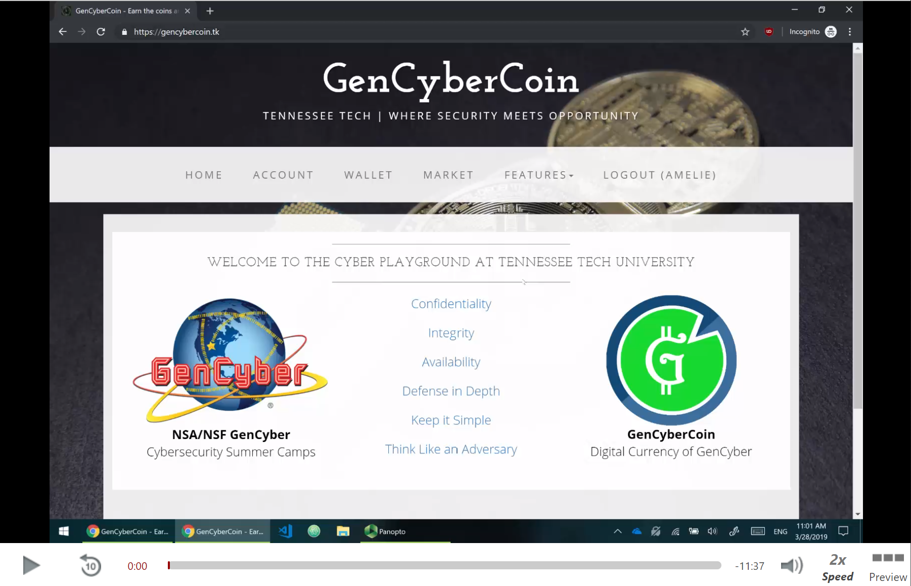
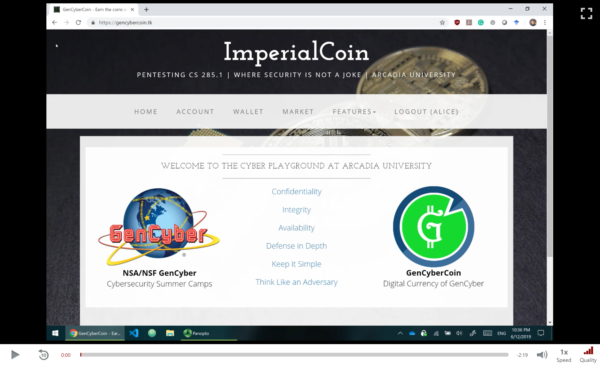

# Introduction

GenCyberCoin is the project developed by Dr. Vitaly Ford in collaboration with Cybersecurity Education Research and Outreach Center at Tennessee Tech University (Dr. Ambareen Siraj) as a part of the NSA/NSF GenCyber grant. GenCyberCoin is a web platform that teaches students the following concepts:

- Cryptocurrency concepts and digital currency trading markets, including blockchain applications
- Cybersecurity principles (confidentiality, integrity, availability, defense in depth, keep it simple, think like an adversary)
- Bug bounty program, software bugs, and secure coding
- Password management and its strength
- Social and ethical norms and values
- Reconnaissance

GenCyberCoin has been successfully deployed at Tennessee Tech's GenCyber summer camps in 2017 and 2018. Students of 8-12 grades expressed high enthusiasm and actively participated in the GenCyberCoin platform, searching for bugs, performing reconnaissance, and earning coins for their leadership skills and willingness to learn cybersecurity. They later spent their coins at the GenCyberCoin marketplace to buy real items that our camp's Team has prepared for them.

GenCyberCoin reinforces the objectives that the GenCyber program has established. It complements the existing GenCyber camp activities and facilitates building curiosity and passion to pursue cybersecurity and to solve challenges in this field.

A 12-minute summary video on GenCyberCoin platform for instructors/admins is available here:

A 2-minute summary video on GenCyberCoin platform for students is available here:

# Bug Bounty

A Bug Bounty walk through (solution video) is available upon request.

# Docker instructions

GenCyberCoin is dockerized (runs on nginx + gunicorn + postgresql + python3.7 + Django) and to run GenCyberCoin through Docker, you would need to install:
 - Docker,
 - Docker Compose,
 - and if you have Mac or Windows, you would need to install Docker Machine.

After installing the above-mentioned software, open the Docker Terminal and navigate to this project's main directory (a place where `build.sh` is located). Then, run `build.sh` from the Docker Terminal (by typing `./build.sh`) and it will build and run the containers. Upon successful execution, the GenCyberCoin will be running on your IP address, port 80. You can navigate to it in your browser and go straight to [creating administrators](#creating-administrators) section.

To stop the containers, type `docker-compose down` from the same place (where `build.sh` is located). All your data will be saved even after stopping and starting the containers back up again.

# Local setup instructions

The instructions for setting up a local version of the GenCyberCoin project can be found [here](instructions/Local_setup.MD).

# Amazon Web Services (AWS) setup instructions

The instructions for setting up the GenCyberCoin project on AWS can be found [here](instructions/AWS_setup.MD).

# Custom Domain setup instructions

The instructions for setting up a custom domain for your version of the GenCyberCoin project can be found [here](instructions/Domain_setup.MD).

# SSL Certificate for AWS setup instructions

The instructions for setting up a secure website certificate for you version of the GenCyberCoin project can be found [here](instructions/SSL_setup.MD).

# Creating administrators

The default superuser that is allowed to create school administrators can log in with the following credentials:  
username: `gcsuperuser` 
password: `gcsuperuser`  
**EXTREMELY IMPORTANT**: As soon as you log in, change your password immediately on the `Account` page. 

After generating codes for your GenCyber Team (administrators of your GenCyber summer camp) on the `Code generator` page under `Admin` menu, your GenCyber Team can register their accounts on the front page of GenCyberCoin, using those codes. 

**IMPORTANT**: when you register the accounts, make sure that your security answers are not easy to guess based on the questions because there is a `Forgot your password` option that allows you to enter the account by guessing correctly two security questions out of three which means that your K12 students could potentially try to social engineer one of your GenCyber Team members to get into their accounts, just saying. 

Additional `admin panel` exists for the `gcsuperuser` that you can access by navigating to `localhost/gcsuperuser/` (both slashes are important to type). However, use this `admin panel` at your own risk because it access directly the data that relates to everything on the website.

# Questions/bugs/suggestions?

Contact Vitaly Ford fordv@arcadia.edu with one of the following subject lines, depending on what you would like to inquire:  
`GenCyberCoin:Bug` 
`GenCyberCoin:Question` 
`GenCyberCoin:Suggestion`

# Acknowledgements

We thank [NSA/NSF GenCyber program](https://www.gen-cyber.com/ "NSA/NSF GenCyber Program") for funding the implementation of this project.

We also thank Andy Malinsky and Ivan Zhang, a Computer Science and Mathematics students at Arcadia University, for bug hunting, testing the project's code, and helping with writing these instructions.

# Hall of Fame

A list of students from different schools who contributed to identifying security flaws on this platform (alphabetic order) and sharing those with us.

1. Devkumar Banerjee
1. Diego Mannikarote
1. Kevin Zhang
1. Leo Abanov
1. Logan Warren
1. Pierce Mannikarote
1. Ryan Glendenning
