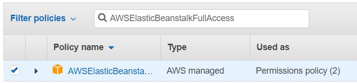
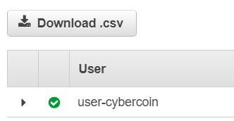
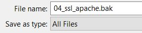

## AWS account setup

1. Create an AWS account [here](https://aws.amazon.com/free/ "Create AWS Account with Free Tier") (for a new user, first year falls under a Free Tier that provides enough free AWS resources to deploy and run GenCyberCoin project for the whole year).
2. You can also [apply to join](https://www.awseducate.com/registration#APP_TYPE "AWS Educate Program") the AWS Educate Program as an Institution and within a few weeks, if approved, you will be able to receive a certain number of free AWS credits as an AWS Educator which will be enough to run GenCyberCoin for half a year (the rest of the year the machines will be shut down in any case) in the following years.

## Software installation and configuration

1. Install [python3](https://www.python.org/downloads/). To check if you already have Python installed, type the following command in the command prompt or terminal: `python -V`.
  
    * Click the yellow button to download the latest version, which includes pip. Refer to the links under the button for downloading Python on other operating systems such as Mac OS or Linux/UNIX. 
  
      
    
      **IMPORTANT**: Be sure to check the box next to "Add Python 'latest version' to PATH"
  
      

2. Follow the instructions on [Install the Elastic Beanstalk Command Line Interface](https://docs.aws.amazon.com/elasticbeanstalk/latest/dg/eb-cli3-install.html) to install EB CLI.
    * Make sure your current version of python matches the version in the environment path. For example, if using (Python 3.7.0), the path variable would be:  %USERPROFILE%\AppData\Local\Programs\Python\Python37\Scripts

## Launching GenCyberCoin project

1. Create a User:

    a. Under the Services drop-down, search for "IAM" which is also located under the "Security, Identity & Compliance" section. Click on “Users” on the left-hand side, then click the button “Add User.”
    
    b. Create a username (e.g. cybercoin), and assign the user "Programmatic access".

    c. For permissions, select the third option of “Attach existing policies directly,” then search for the following policy: `AWSElasticBeanstalkFullAccess`. Click the checkbox next to the policy name.

    
  
    d. Once you create the new user, download this user’s secret ID and key by clicking the “Download .csv” button.
  
    
  
    Save this for your future record as you will use that to connect to AWS ElasticBeanstalk later on your computer.
    
2.	**VERY IMPORTANT**: 

    a. By default, this project redirects all web requests to HTTPS instead of HTTP but when you set it up for the first time, you do not have a certificate and SSL is turned off. 
    
    Therefore, we need to change the extension of the following file from (.config) to (.bak). Otherwise when you set up everything, you will see a blank page instead of the GenCyberCoin home page. You can open the file and Save As with the extension (.bak).
  
     
  
    b. The file’s location is: cryptocoin/.ebextenstions/04_ssl_apache.config. 
  
    Note: After setting up the certificate (at the very-very-very end when everything else works), you will be able to change 04_ssl_apache.bak back to 04_ssl_apache.config.

3.	Configure Elastic Beanstalk on AWS:
  
    a. Navigate to the cryptocoin directory in the command prompt / terminal 
    
      * **IMPORTANT**: This directory is the folder where you can see the manage.py and requirements.txt files. Make sure you are in the correct folder.
    
      * If you see the .elasticbeanstalk folder in your file drectory, delete that folder before typing any eb commands. 
  
    b. Type the following commands to configure the elastic beanstalk on AWS:
  
    `eb init`
  
      * Select python 3.6 or later, you can say NO to SSH unless later you will want to connect to the machine for some reason. All updates will be done through one command, eb deploy, which does not require SSH connection. 
  
      * Follow the instructions and make the appropriate selections, most of which can be left at default settings. You can set your name to whatever you want, (e.g. 'yourschoolname'gencyber). This is the place where you will be required to enter the secret ID and key of the cybercoin user that you have previously downloaded.
  
    `eb create -db.engine postgres` 
  
      * Note: You can leave the settings as the default selections. Be careful when it prompts you to create an RDS DB master password. The password cannot have a white space  or the following symbols `/`, `"`, or `@`.
  
      * This command will take a while to finish.
  
    `eb console`
  
      * This is just for testing purposes. It should open a new tab in your browser on the Elastic Beanstalk page where you should see your project. The health may be in red, which is alright, as it should be green after the end of this setup process.

4.	A database will be setup automatically at this point.

5.	Set up the AWS S3 bucket:
  
    a. Connecting the bucket with the project will store files including images, CSS, and Javascript. Sign in to the [AWS Console](https://console.aws.amazon.com) and choose "S3" in the Services drop down under the "Storage" section. 
  
    Please refer to the directions below as you go through the bucket setup steps found [here](https://www.codingforentrepreneurs.com/blog/s3-static-media-files-for-django/). 
    
    * Follow the link's directions starting from step 3, all the way until you reach the section called "Django Setup." You do not need to do follow Django Setup as that has already been done in the project 
  
    * Your bucket name can be anything you want, but it will not allow you to choose a name that has previously been created by someone else in AWS S3. 
  
    * **IMPORTANT**: After creating the bucket, note the bucket name and the region.
    
    * You may skip step 4, as we have already added the AWSElasticBeanstalkFullAccess policy.
  
    * In step 5, after clicking "Create Policy", click on the JSON tab to set the Policy Document.
  
    * After setting the Policy Document and the CORS policy, you will be able to set the Policy Name once you click on Review Policy.

    * Be sure to add your newly created policy to your user’s permissions, by clicking Attach existing policies directly, and searching for your policy name.

    b. Open the file located in cryptocoin/aws/conf.py and change the following:
      * `AWS_ACCESS_KEY_ID` and `AWS_SECRET_ACCESS_KEY` - to the values in your cybercoin user’s downloaded .csv file.
  
      * `AWS_STORAGE_BUCKET_NAME` - to the bucket name you created when you followed the instructions from the link above.
  
      * `AWS_S3_REGION_NAME` - to the region where your bucket is in (e.g. ‘us-east-2’).
  
        Just in case, you can find the region name if you open the [Amazon S3](https://console.aws.amazon.com) page and note the Region Name in the top right corner. Then, go to the [AWS Regions](https://docs.aws.amazon.com/general/latest/gr/rande.html) page and scroll down to see the list of Regions and their corresponding Region Names.
  
    c. Open the file located in cryptocoin/.ebextensions/02_python.config and change the `SECRET_KEY` value to the one generated on this [wesbite](https://www.miniwebtool.com/django-secret-key-generator/) by clicking on Generate Django Secret Key button. 
    
      * Remember to keep double quotes around the `SECRET_KEY` value in the 02_python.config file.
  
    d. In the command prompt / terminal, navigate again to the cryptocoin folder where you can see the manage.py file and type the following command: 
    
    `python manage.py collectstatic`
  	
      * This command will collect all static files like images, CSS, Javascript, and load them to the AWS S3 bucket   that you have previously connected with this project. 
      
      * If that did not happen, then something went wrong with the  previous steps and your S3 bucket was not connected with the project. Make sure that you correctly entered `AWS_ACCESS_KEY_ID` and `AWS_SECRET_ACCESS_KEY` in the cryptocoin/aws/conf.py file, as well as make sure that the `AWS_STORAGE_BUCKET_NAME` and the    `AWS_S3_REGION_NAME` are updated with the appropriate names from your S3 bucket.

6. Navigate to the directory where manage.py is located in and type the following command: 

    `eb deploy`
    
    * In a few minutes your GenCyberCoin project should be running on AWS Elastic Beanstalk.

    * You can locate the project either by typing the command `eb console` or navigating to [AWS Console](https://console.aws.amazon.com/console/home "AWS Console") in your browser and selecting `Elastic Beanstalk` among the `AWS Services`.
    
    * To view the project in the browser, simply click the URL located at the top of your Elastic Beanstalk environment. 
      Note: The page may fail to load the first time you try to access it. Simply refresh the page and it should be working.