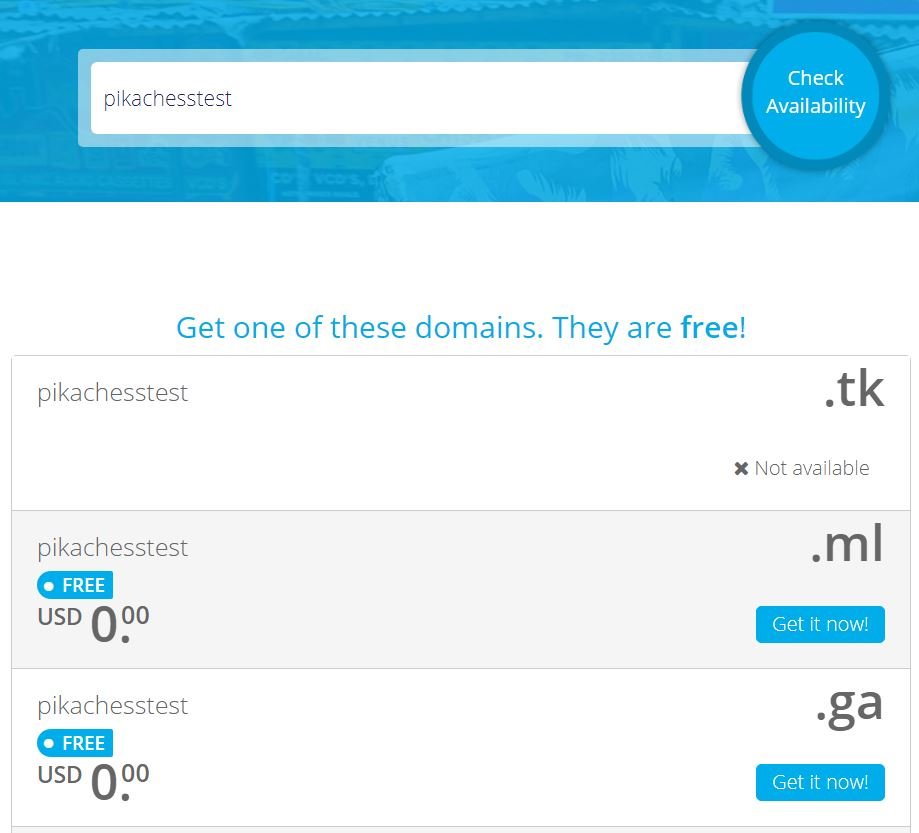
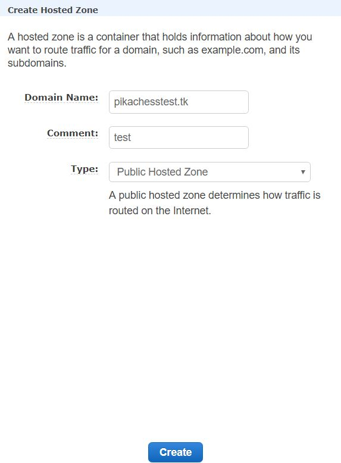
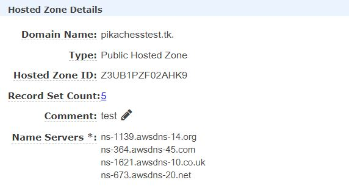
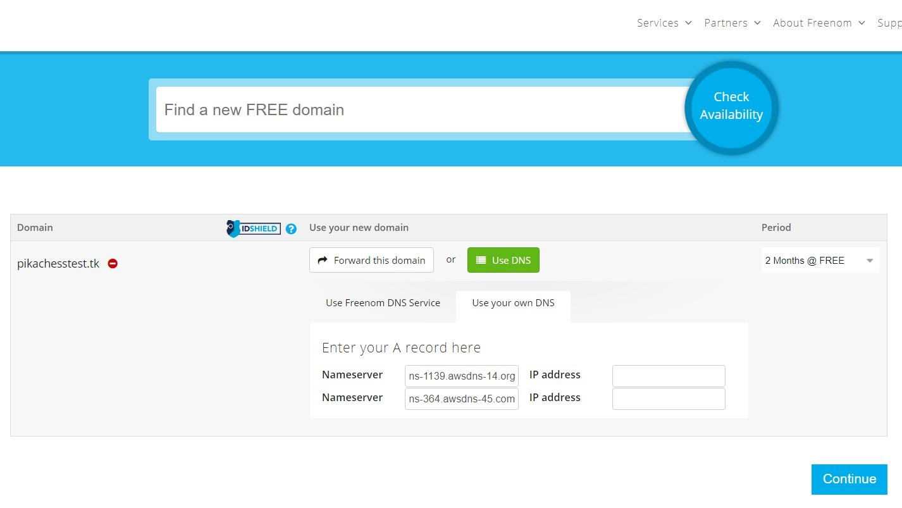
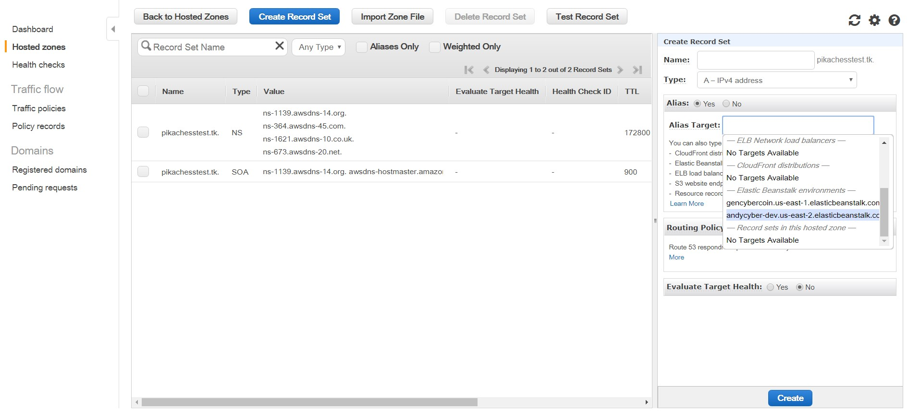
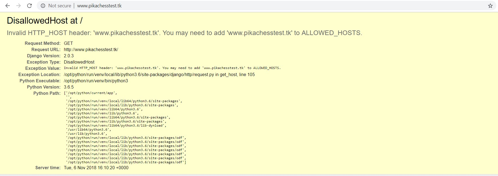
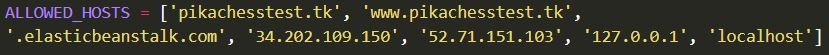

## Create a Custom Domain Using Freenom

1. Navigate to [Freenom](https://www.freenom.com/en/index.html?lang=en) and check the availability for your desired domain (i.e. google, wikipedia, youtube). Choose an available free extension by clicking "Get it now!"

    For testing purposes, the domain name used in the following images is meant to be a random one as to not limit practical domain name options for users.

    

    Once you have made a selection, click the "Checkout" button. Keep this page open for the next step.

2. Open a new tab or window and sign in to the [AWS Console](https://console.aws.amazon.com). 
    
    a. Under the Services drop-down, search for "Route 53" which is also located under the "Networking & Content Delivery" section.
    * On the left-hand side, click on "Hosted zones."
    * Click the "Create Hosted Zone" button along the top. Input your anticipated domain name, including the extension, and keep the Type Public. 
    * Click Create.

        
    
    b. Hover your mouse over your Hosted Zone's ID and click to reveal the Hosted Zone Details on the right.

    

    * Back in your Freenom checkout select "Use DNS" and "Use your own DNS."
    * Copy and paste the first two Name Servers from your Hosted Zone into the Hostname fields in your Freenom domain checkout.

        

    * You can set the period to be "12 months @ FREE.
    * Click Continue.
    
    Upon Review & Checkout you can verify ownership of the domain by email. Check your email for the verification link. 

3. Back in Hosted zones, click on your Hosted Zone name.

    a. Select the "Create Record Set" button along the top.
    * Leave the Name field blank.
    * Make sure the Type is set to "A - IPv4 address."
    * Set Alias to "Yes."
    * Set the Alias Target to your Elastic BeanstalkEnvironment URL.
    * Highlight and copy this target URL, as we will need itin the next step.
    * Click "Create."

        

    b. Select the "Create Record Set" button along the top.
        
    * Set the Name field to "www" as shown below.
    * Change the Type to "CNAME - Canonical name.
    * Set Alias to "No."
    * In the Value field, input the URL of your Elastic Beanstalk Environment that you copied from the previous step.    
    **IMPORTANT:** make sure there is no period at the end of the                 URL in the Value field.  
    * Click "Create."

    c. **OPTIONAL:** You can test your new link by searching for your domain name. You should see something similar to the following image, which means a connection has been made.

    

4. Navigate to the cryptocoin/cryptocoin/settings.py file.
        
    * Edit the `ALLOWED_HOSTS` variable so that the first two elements are your custom domain, matching the format in the image below.

        

5. Navigate to the directory where manage.py is located in the command prompt / terminal and type the following command: 

    `eb deploy` 

6. Once your Elastic Beanstalk Environment is done updating, you can test your link by searching for your domain name. 

Note: The first time you try loading the page you may get an error. Refresh the page or try searching again to fix the issue.