## Software installation and configuration

1. Install [python3](https://www.python.org/downloads/) and [PostgreSQL server](https://www.postgresql.org/download/). Installation directions below.

#### Python

  * Click the yellow button to download the latest version. Refer to the links under the button for downloading Python on other operating systems such as Mac OS or Linux/UNIX.

    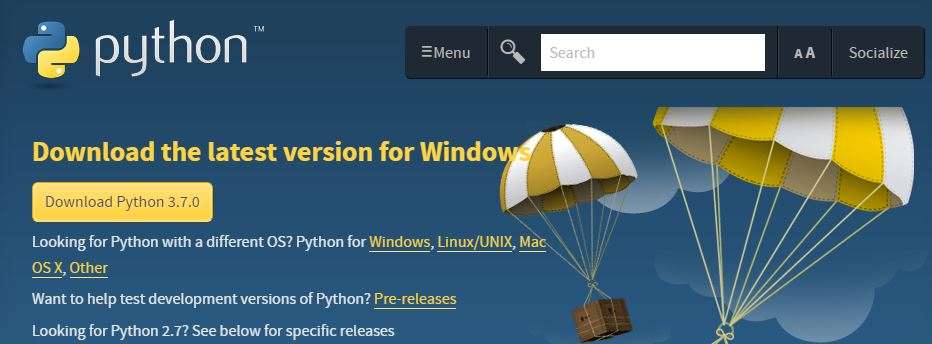

    **IMPORTANT**: Be sure to check the box next to "Add Python 'latest version' to PATH"

    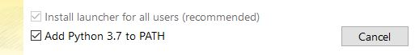

#### PostgreSQL
  * Select which operating system you are using to download PostgreSQL.

    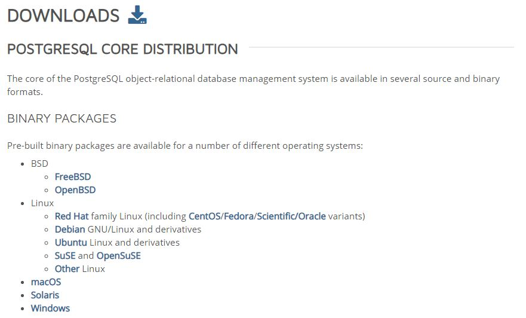

  * Click "Download the installer", and be sure to select the latest version (_currently 10.5_). This version comes with pgAdmin 4.  

    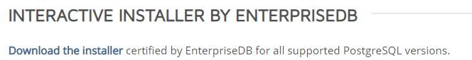

  * Open the installer to access the PostgreSQL Setup Wizard.

    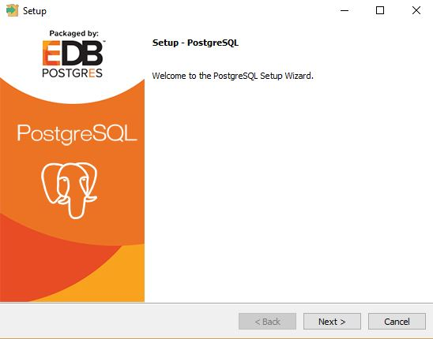

    You can leave all components checked, and do not have to change the locale or port number. The default port number should be 5432.
  **Be sure to remember your database superuser password.**

2. After downloading or cloning this repository, navigate to the cryptocoin directory in the command line prompt or terminal. The requirements.txt file should be in that directory.

3. Make sure you have the latest version of pip installed by typing the following command:

    `python -m pip install --upgrade pip`

4. Install the prerequisites by typing the following command: 

    `pip install -r requirements.txt`
#### Possible Errors
  * If you encounter the error "pg_config executable not found" when trying to install the `psycopg2` package, try running the following command to install it individually:

    `pip install psycopg2`  

  * If you encounter an error while installing the `reportlab` package, try installing the latest [Microsoft Visual C++ build tools](https://visualstudio.microsoft.com/downloads/). Scroll down to "All downloads", expand "Tools for Visual Studio 2017", and download "Build Tools for Viual Studio 2017".

    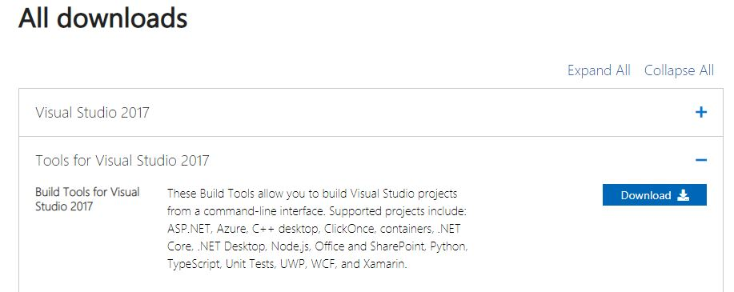

    Check the box for Visual C++ build tools, then click "Install" in the bottom right.

    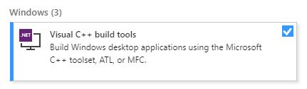

    Note, this installation may take a few minutes.

5. Start PostgreSQL server by connecting to it using pgAdmin.
   * Launch the pgAdmin application.

   * Creating a server:

      * Right click on "Servers", hover over "Create", and select "Server...".

        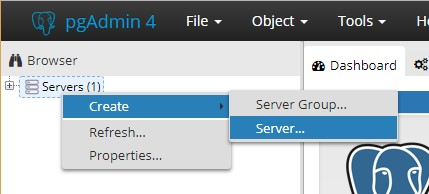
     * Under the General tab, be sure to give it a name (e.g. MyServer).

     * Under the Connection tab, type "localhost" for the Host name/address.
      Make sure that the port number is the same as the one specified during installation. Enter your password that you created while installing PostgreSQL.

        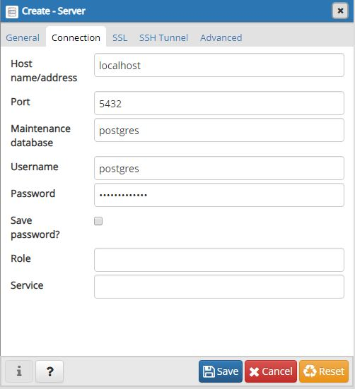

        Click Save.

    * Click the plus icon next to your server name. 
      Right-click on "Login/Group Roles" to create a new role. 
      Under the General tab, set the "name" to `coin_admin`. 
      Under the Definition tab, set "Password" to `go-figure-me-cow`. 
      Under the Privileges tab, set "Can login?" to `Yes`. 
      Click `Save`.

    * Right-click on Databases to create a database. 
      Name it `coin_db` and set the "Owner" to `coin_admin`.

      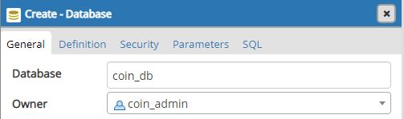

      Click Save.

      Make sure that you are connected to the coin_db. It is disconnected if it displays a red 'x'. Click on it to connect to it.

      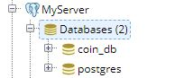

6. In the command line prompt or terminal that is opened in the cryptocoin directory, type the following command:

    `python manage.py migrate`

    This will migrate the existing database model to the PostgreSQL server.

7. At this point your Database setup on the local machine is finished and you can now launch the GenCyberCoin project.

8. In the command line prompt or terminal that is opened in the cryptocoin diirectory, type the following command to set up default superuser (gcsuperuser) and security questions:

    `python manage.py setdefaults`

## Launching GenCyberCoin

1. Make sure you started PostgreSQL server.

2. Navigate to the GenCyberCoin project's directory called cryptocoin in the command line prompt or terminal.
   * Type the following command:

      `python manage.py runserver 80`

      This will launch the GenCyberCoin project on the local machine, port 80.

   * Open your browser and type the following in the address bar:

      `localhost`

   * At this point you should be able to see the GenCyberCoin's front page.
