## Setup AWS SSL Certificate

1. Sign in to the [AWS Console](https://console.aws.amazon.com)

2. Under the Services drop-down, search for "Certificate Manager" which is also located under the "Security, Identity & Compliance" section.

    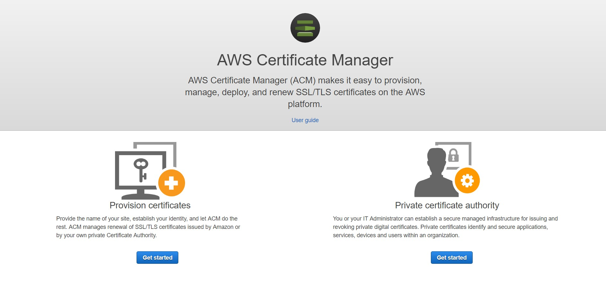

    a. Click "Get started" under the Provision certificates section.
    
    b. Click on "Request a certificate". Select "Request a public certificate".
    
    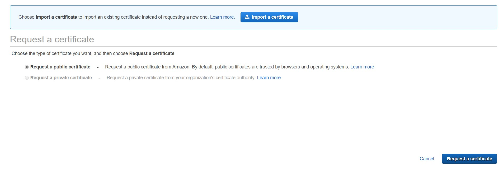

    c. Add your domain name and click "Next".
    
    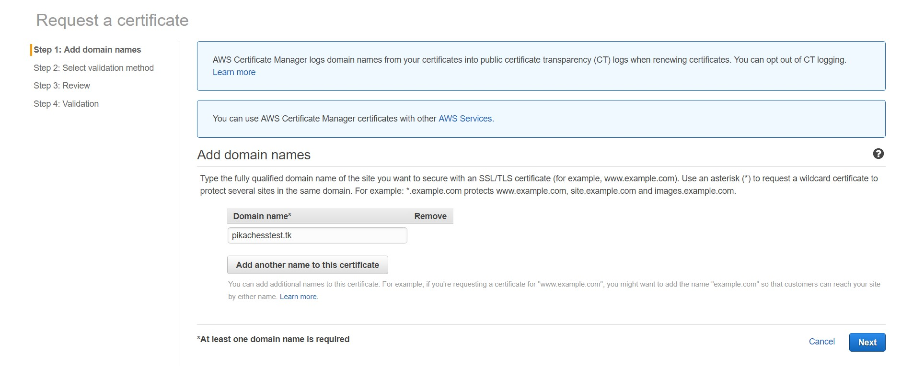

    d. Select "DNS validation" as the validation method, and click "Review".
    
    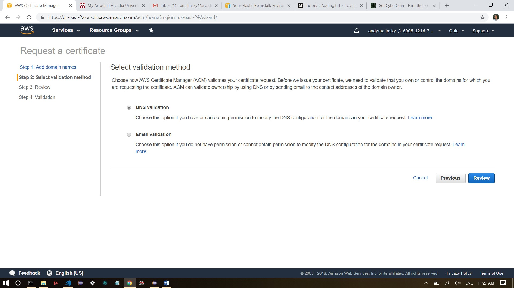

    e. Review your selections, and click "Confirm and request".

    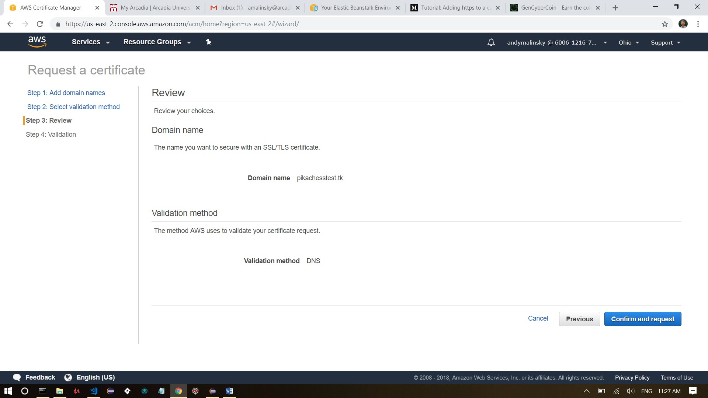

    f. For the validation, click the "Create record in Route 53" button to save this DNS configuration.

    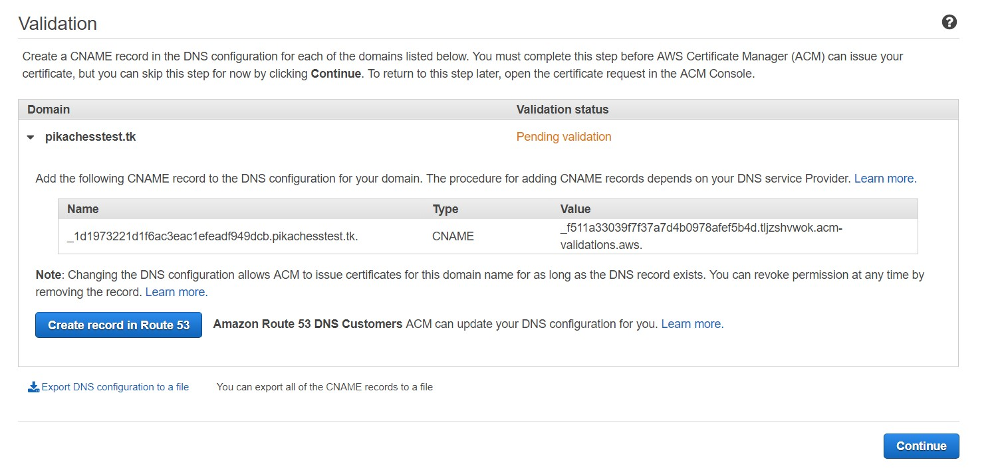

3. Navigate to your Elastic Beanstalk environment. 
    
    a. Select "Configuration" on the left-hand side.

    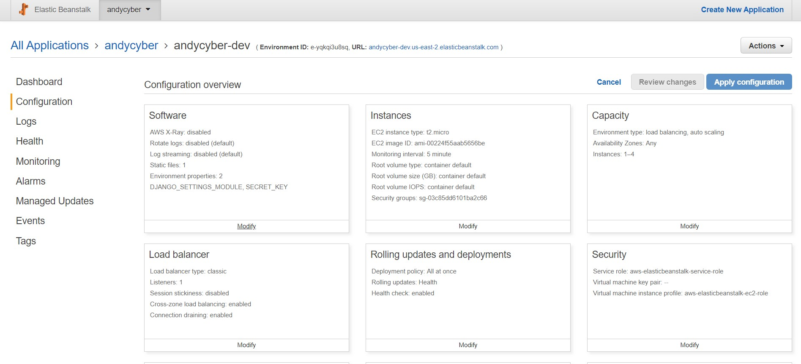

    b. Under the Load balancer section, click "Modify".

    c. Click the "Add listener" button located on the right-hand side.

    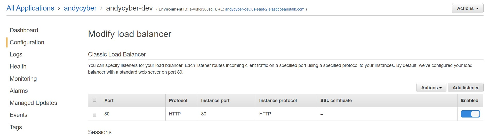

    d. Set the fields to:
        Listener port:      443
        Listener protocol:  HTTPS
        Instance port:      80
        Instance protocol:  HTTP
        SSL certificate: _the certificate you          previously created_

    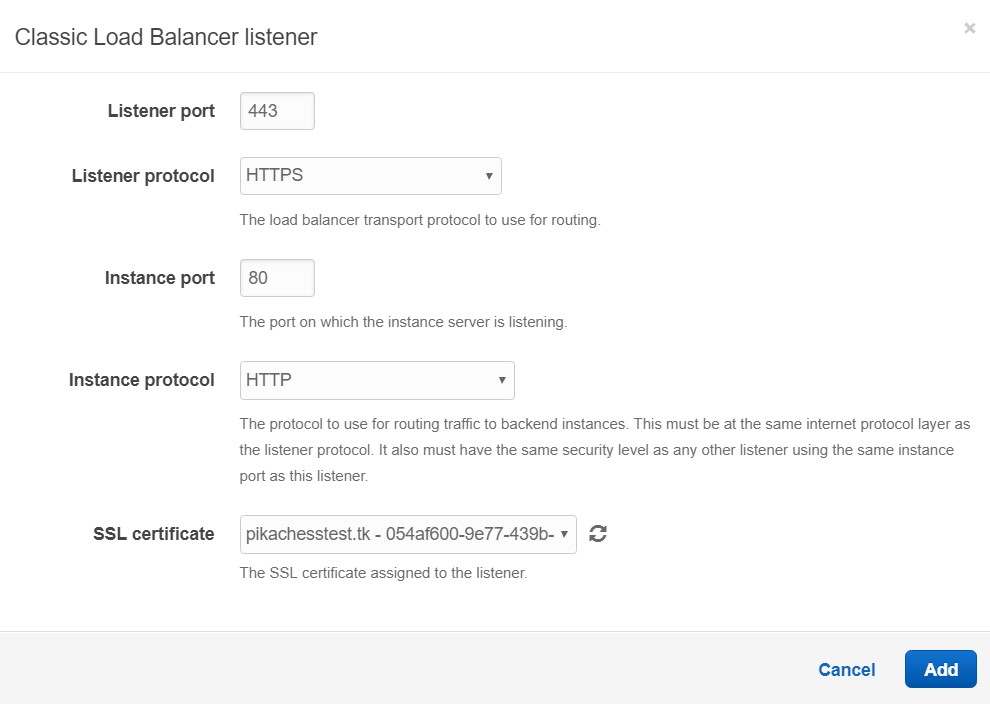

    e. After adding the new listener, you should see it listed as Pending.

    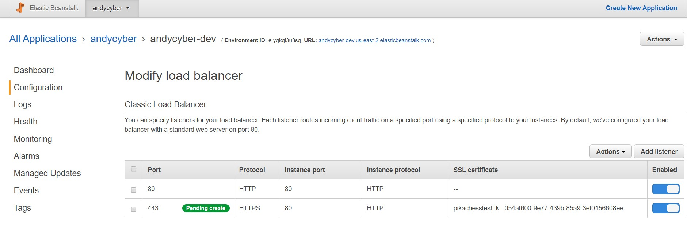

    f. **IMPORTANT:** Be sure to scroll down to the bottom of the page and click "Apply".

    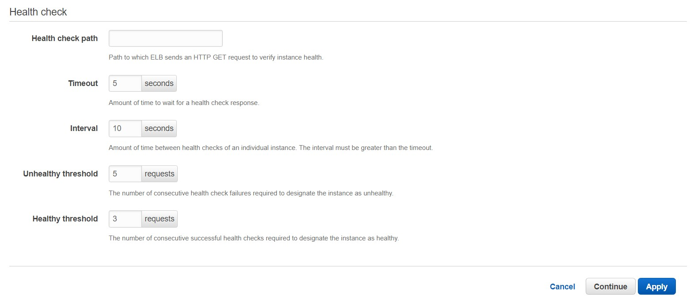

    g. Navigate back to your Elastic Beanstalk Dashboard and wait for the environment to finish updating.

    h. Once your environment is done updating, rename the gencybercoin\cryptocoin\.ebextensions\04_ssl_apache_config file so that its extension is .config.

    i. Navigate to the first cryptocoin directory in the command prompt / terminal. You should be able to see the manage.py file in this directory.

    j. Run the following command:
    
    `eb deploy`

    k. In your web browser, go to your new url (i.e. "https://yourdomainname").